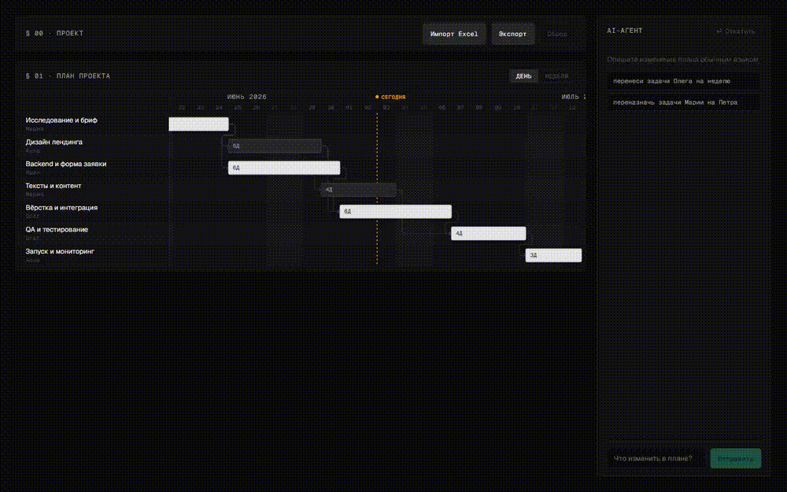

# AI Gantt Planner

Диаграмма Гантта, которую редактируешь голосом. Пишешь в чат «перенеси задачи Олега на неделю позже» или «переназначь работу Марии на Петра» — агент применяет правку, и бары на экране переезжают на новое место. Можно импортировать и экспортировать Excel, откатить любое изменение агента. Тот же набор инструментов выставлен наружу по MCP — так что план можно двигать и из Claude Desktop, Cursor или любого другого MCP-клиента.

**Живое приложение:** https://ai-gantt-planner-psi.vercel.app



Ещё скриншоты — в [`docs/shots/`](docs/shots/).

---

## Быстрый старт

### Бэкенд (FastAPI)

```bash
python -m venv .venv
.venv/Scripts/pip install -r requirements.txt
.venv/Scripts/pip install pytest httpx   # только для тестов

# детерминированный режим: без обращений к LLM, ключ не нужен
MOCK_LLM=1 .venv/Scripts/python -m uvicorn api.index:app --reload --port 8000
```

> **Про Python на Windows.** В `.python-version` указан `3.13`, но закоммиченный `.venv` собран на `3.12`, который стоял на машине разработки (`.venv/Scripts/python --version` → `3.12.10`). Работает и там, и там. Пересоздашь venv на 3.13 — тоже нормально.

Переменные окружения бэкенда (`.env`, в git не попадает):

| Переменная | Когда нужна | Зачем |
|---|---|---|
| `OPENROUTER_API_KEY` | для настоящего чата | ключ OpenRouter для LLM-агента (`anthropic/claude-sonnet-4.5`, при ошибке — фолбэк на `openai/gpt-4o`) |
| `DATABASE_URL` | опционально | строка подключения к Neon/Postgres. Не задашь — приложение работает на in-memory хранилище (для локальной разработки и демо годится; при рестарте состояние сбрасывается) |
| `MOCK_LLM=1` | опционально | вместо реального вызова API включает детерминированную заглушку, которая матчит команду по ключевым словам. Используется в тестах и E2E, удобна для локальной работы без трат на токены |
| `ENV=test` | опционально | тоже переключает на заглушку LLM и открывает тестовый роут `/api/agent-test-mutation`, который нужен тесту на undo |

### Фронтенд (Vite + React + TS)

```bash
cd frontend
npm install
npm run dev       # http://localhost:5173, проксирует /api на :8000
```

Указать фронтенду другой адрес бэкенда можно через `VITE_API_BASE` — так делает Playwright, чтобы бить напрямую в `127.0.0.1:8000` против собранной preview-версии.

---

## Архитектура

Монорепо, один проект на Vercel, один URL. SPA и API живут на одном домене: фронт зовёт `/api/*`, Vercel переписывает эти запросы на единственное FastAPI-приложение в `api/index.py`.

```
                         ┌────────────────────────────┐
                         │        Vercel (1 проект)    │
                         │                              │
   Браузер ── /  ───────▶│  Vite SPA (frontend/dist)   │
                         │                              │
   Браузер ── /api/* ───▶│  api/index.py (FastAPI)      │
                         │        │                      │
                         │        ▼                      │
                         │   api/tools.py  (единый       │
                         │   слой мутаций плана)         │
                         │     │              │           │
                         │     ▼              ▼           │
                         │  внутренний агент  MCP-сервер  │
                         │  (SSE /api/chat)  (/api/mcp)   │
                         │     │                            │
                         │     ▼                            │
                         │  api/store.py → Neon Postgres    │
                         │  (или in-memory для локалки)     │
                         └────────────────────────────┘
```

**`api/scheduler.py`** — чистая функция `compute_schedule(plan)`. Даты нигде не хранятся. У задачи есть только `duration_days`, `predecessors` и `lead_days` (сколько календарных дней подождать перед стартом — так независимая задача может начаться с конкретной даты, а не всегда от старта проекта). Начало и конец считаются заново при каждом чтении через топологическую сортировку: `start = max(конец предшественников) + lead_days`, `end = start + duration`. Цикл в зависимостях бросает `CycleError`. Критический путь находим, идя назад от задач, которые заканчиваются в самую позднюю дату проекта.

**`api/tools.py`** — единственное место, где план меняется: `add_task`, `update_task`, `delete_task`, `set_dependencies`, `reassign_tasks`, `shift_tasks`. Это чистые функции: на вход `Plan`, на выход `PlanPatch` (`{plan, changed_ids}`). Перед возвратом всё проверяется — нет висящих предшественников, нет циклов.

**`api/tool_registry.py`** — JSON-schema обёртки в стиле OpenAI над этими функциями плюс `dispatch(name, args, plan)`. Реестр используют оба потребителя: и внутренний агент, и MCP-сервер. Так что «что делает инструмент» описано ровно один раз, и две точки интеграции не разъезжаются.

**`api/agent.py`** — цикл tool-calling чат-агента (`run_agent_turn`). Стримит события `tool_call` → `patch` → `message` → `done`. У агента есть память диалога: прошлые реплики (`history`) сворачиваются в сообщения LLM перед новым запросом, поэтому агент не переспрашивает то, на что пользователь уже ответил. Есть инструмент `undo_last_turn` — по фразе «отмени» / «откати правку» агент откатывает план к состоянию до последней мутации. Системный промпт устойчив к произвольному вводу: любая задача, которую просят добавить, считается легитимной («купить молоко» — валидная задача); переспрашивает агент только при настоящей неоднозначности или когда просьба субъективна («сделай план красивее») и не даёт критерия для конкретной мутации. Доступ к модели спрятан за маленьким протоколом `LLM` с тремя реализациями: `OpenRouterLLM` (настоящий, `anthropic/claude-sonnet-4.5` с фолбэком на `openai/gpt-4o`), `MockLLM` (детерминированный матч по ключевым словам) и `default_llm()`, который выбирает `MockLLM`, когда стоит `MOCK_LLM=1` или `ENV=test`.

**`api/mcp_server.py`** — настоящий MCP-сервер (официальный SDK `mcp`, `FastMCP`, транспорт streamable-HTTP, `stateless_http=True`), примонтированный как ASGI-подприложение на `/api/mcp`. Stateless — потому что serverless-функции Vercel не гарантируют, что два запроса попадут на один инстанс, а значит держать серверную MCP-сессию между вызовами не на чем.

**`api/store.py`** — протокол `Store` с двумя реализациями: `MemoryStore` (словарь плюс список снапшотов, используется в тестах и по умолчанию локально) и `PostgresStore` (Neon через `psycopg`, JSONB-колонки под состояние плана и историю снапшотов). `get_store()` берёт Postgres, если задан `DATABASE_URL`, иначе память. Undo — это стек снапшотов: каждый меняющий запрос снимает снапшот плана перед первым изменением, а `POST /api/undo` возвращает последний снапшот на место.

**Фронтенд** — Vite + React 19 + TypeScript + Zustand. Диаграмма Гантта нарисована руками на SVG, без чартовых библиотек: слева колонка со строками задач и исполнителями, справа SVG-панель с недельной сеткой, пунктирной линией «сегодня», безье-стрелками зависимостей и барами. Бар анимируется (CSS-переход по `x`/`width`), когда его id прилетает в `changed_ids` события `patch` по SSE, — и на пару секунд подсвечивается затухающим зелёным.

---

## Ключевые решения

- **Кастомный SVG-Гантт, а не библиотека.** Главный момент продукта — «бары плавно переезжают на новое место, пока в чате появляется чип с правкой». Готовые Gantt-компоненты анимируют не так, как здесь нужно, поэтому полный контроль над отрисовкой важнее готовой обвязки.
- **Даты считаются, а не хранятся.** У задачи есть только длительность и предшественники — начало и конец выводятся. Из-за этого любая мутация (перенос, переназначение, добавление, удаление) остаётся согласованной сама собой: нет отдельного шага «пересчитать всё расписание и надеяться, что ничего не поехало», потому что хранить нечего, чему ехать.
- **Один слой инструментов на обе точки.** `api/tools.py` + `api/tool_registry.py` одинаково используют и чат-агент, и MCP-сервер. Новая возможность — это одна функция, написанная один раз; и пользователь в чате, и разработчик из своего MCP-клиента получают её сразу, с одинаковой валидацией.
- **SSE, а не WebSocket.** Serverless-рантайм Python на Vercel умеет стримить HTTP-ответ, но не даёт постоянный двусторонний сокет. `POST /api/chat` стримит SSE-события построчно — ровно та форма, что здесь нужна (сервер → клиент, один запрос на ход чата), и деплоится без лишней инфраструктуры.
- **Шов с детерминированным `MockLLM`.** `default_llm()` подставляет заглушку, когда стоит `MOCK_LLM=1` или `ENV=test`. Против неё гоняются все юнит-тесты и все Playwright-спеки (включая golden path и записанное демо): никакой флакости от недетерминированной модели, никаких трат на токены в CI, и при этом тот же самый код-путь, что проходит настоящий `OpenRouterLLM`.

---

## MCP

Инструменты мутации плана выставлены как стандартный MCP-сервер (транспорт streamable-HTTP) по адресу:

```
/api/mcp/          ← слэш в конце обязателен, FastMCP монтируется ровно на этот путь
```

Выставлены: `get_plan`, `add_task`, `update_task`, `delete_task`, `set_dependencies`, `reassign_tasks`, `shift_tasks`. Каждый меняющий инструмент грузит текущий план из общего хранилища, применяет изменение через те же проверенные функции `api/tools.py`, что и чат-агент, сохраняет результат и возвращает короткую сводку (id изменённых задач и общее число задач). Ошибка валидации (несуществующий id, цикл зависимостей и т.п.) возвращается обычным результатом инструмента (`"Ошибка: ..."`), а не падением.

### Как подключить клиент

Локально:

```json
{
  "mcpServers": {
    "ai-gantt-planner": {
      "url": "http://127.0.0.1:8000/api/mcp/"
    }
  }
}
```

К задеплоенному приложению (Claude Desktop, `claude_desktop_config.json`, или любой MCP-клиент со streamable-HTTP):

```json
{
  "mcpServers": {
    "ai-gantt-planner": {
      "url": "https://ai-gantt-planner-psi.vercel.app/api/mcp/"
    }
  }
}
```

Сервер намеренно stateless (`stateless_http=True`): между запросами не нужна привязка к сессии — это совпадает с тем, как Vercel вызывает serverless-функции. Известная дыра — эндпоинт пока без аутентификации; см. [`docs/roadmap-to-production.md`](docs/roadmap-to-production.md).

---

## Тестирование

**Юнит-тесты (pytest, 60 штук)** — модели, планировщик (расчёт дат, детекция циклов, критический путь), Excel-импорт/экспорт с сообщениями об ошибке по номеру строки, сид-данные, инструменты, реестр инструментов, хранилище (memory), REST-эндпоинты, цикл агента (с фейковым LLM), SSE-эндпоинт чата, undo и диспетчеризация MCP-инструментов:

```bash
ENV=test MOCK_LLM=1 .venv/Scripts/python -m pytest -q
```

**End-to-end (Playwright, desktop + mobile)** — поднимает настоящий FastAPI-бэкенд с `MOCK_LLM=1` и собранный фронтенд, потом гоняет реальный браузер против обоих. На desktop это 14 тест-кейсов:

```bash
cd frontend
npx playwright test --project=desktop
```

Спеки:

| Спек | Что проверяет |
|---|---|
| `smoke.spec.ts` | приложение грузится, сид-план рисует ≥20 баров |
| `gantt.spec.ts` | бары критического пути визуально отличаются, линия «сегодня» на месте |
| `drag.spec.ts` | тянешь правый край бара — меняется длительность и сдвигаются задачи ниже по цепочке |
| `chat.spec.ts` | агент массово правит план вживую и показывает чип с tool-call; undo откатывает |
| `modal.spec.ts` | модалка задачи показывает совпадающие даты и чипы предшественников |
| `excel.spec.ts` | импорт рисует ≥20 баров, экспорт скачивает `.xlsx`, битый файл даёт тост с номером строки |
| **`golden-path.spec.ts`** | весь сценарий сдачи в один непрерывный проход: сброс → импорт → правка через чат → экспорт |
| `demo.spec.ts` | тот же сценарий, специально замедленный и записанный на видео (см. [Демо](#демо)) |

Оба viewport-проекта (`desktop` 1440×900, `mobile` 390×844) заданы в `frontend/playwright.config.ts`. Третий проект, `demo-recording`, матчит только `demo.spec.ts` и включает запись видео.

**Про детерминизм.** Каждый E2E-спек гоняется против бэкенда, поднятого с `MOCK_LLM=1`. `MockLLM` матчит команду по ключевым словам (например, «Олег» + «недел» → `shift_tasks(assignee="Олег", days=7)`) вместо вызова настоящей модели, поэтому результат воспроизводится один в один от прогона к прогону — без сетевой флакости, без трат на токены и без риска, что модель между прогонами передумает, какой инструмент звать.

**Хаос-тесты.** `scripts/chaos_chat.py` — отдельная батарея произвольных и намеренно вредных команд («сделай план красивее», «удали все задачи», «какая погода в Москве?», гибрид, галиматья), прогоняемая через **настоящий** цикл агента с `OpenRouterLLM` (не MockLLM) против свежего сид-плана. Так мы смотрим на поведение реальной модели, не трогая прод: ловим выдуманные изменения, тихие no-op'ы, зацикливания и падения до того, как они дойдут до пользователя.

```bash
set -a && . ./.env && set +a
PYTHONIOENCODING=utf-8 .venv/Scripts/python scripts/chaos_chat.py       # вся батарея
PYTHONIOENCODING=utf-8 .venv/Scripts/python scripts/chaos_chat.py 5 13  # отдельные пункты
```

---

## Демо


Записано скриптовым Playwright-спеком (`frontend/e2e/demo.spec.ts`) против настоящего приложения с детерминированным `MockLLM`-бэкендом. Захваченный `.webm` конвертируется в gif так:

```bash
ffmpeg -i video.webm -vf "fps=12,scale=1000:-1:flags=lanczos" docs/demo.gif
```

Статичные скриншоты — в [`docs/shots/`](docs/shots/) (сид-Гантт, живая правка через чат).

---

## Как мы использовали AI-ассистентов

Проект от и до собран в **Claude Code** (модели Opus и Sonnet) с оркестрацией субагентов. Не один длинный сумбурный чат, а чёткая последовательность фаз — и она видна в истории коммитов и в артефактах под `docs/superpowers/`.

1. **Brainstorming.** Форму продукта (Гантт + чат-агент + Excel + MCP на Vercel) обсудили и зафиксировали до кода — вместе с визуальным направлением (тёмная editorial-эстетика в духе filipp.io) и согласованным мокапом.

2. **Спека → план.** Решения из брейншторма превратились в письменную дизайн-спеку, потом — в подробный пофазовый план имплементации (`docs/superpowers/plans/2026-07-03-ai-gantt-planner.md`) с явными red/green-шагами TDD для каждого модуля бэкенда и требованиями к E2E-покрытию каждого фронтового компонента. Всё это — до первой строчки кода.

3. **Исполнение субагентами по TDD.** План шёл задача за задачей: свежий субагент пишет падающий тест, гоняет его, пишет минимальный код, чтобы прошёл, гоняет снова, коммитит. Каждую фазу проверял отдельный, независимый субагент — тот, кто писал код, и тот, кто его проверял, разные. Поэтому история коммитов читается как мелкие обозримые шаги «сначала тест, потом реализация».

4. **Дизайн-скиллы на фронтенде.** UI прошёл через `frontend-design`, потом через отдельный проход полировки и аудита (`impeccable`) и через ревью анимаций (`design-motion`) — чтобы выловить типовой «AI-slop» и чтобы анимация правки агента (собственно, вау-момент продукта) читалась как задуманная, а не случайная. Заодно субагенты изучали чужие Gantt-библиотеки — не чтобы их подключить, а чтобы подсмотреть удачные визуальные практики.

5. **Верификация через Playwright, а не на глаз.** Под каждое интерактивное поведение (drag-resize, массовые правки через чат, undo, импорт/экспорт, модалка) есть Playwright-спек против настоящего бэкенда в реальном браузере — не только юнит-тесты изолированной логики. Каждое изменение проверялось прогоном. Спеки golden-path и demo дополнительно проходят ровно тот сквозной сценарий, который проверяющий стал бы кликать руками.

6. **Хаос-тестирование агента против живой модели.** `scripts/chaos_chat.py` гонял батарею произвольных команд через настоящий OpenRouter, чтобы убедиться: что бы клиент ни ввёл, ответ разумный — без выдуманных правок, зацикливаний и падений.

7. **Code-review перед деплоем.** Весь проект прошёл ревью целиком до выкатки на прод.

Коротко: печатал Claude Code, но последовательность — реши, специфицируй, распланируй, реализуй тестами вперёд, отревьюй дизайн, проверь — была осознанной, и её видно и в git-истории, и в закоммиченных артефактах `docs/superpowers/`.

---

## Структура репозитория

```
api/            бэкенд на FastAPI (models, scheduler, excel, tools, agent, store, mcp_server, index)
frontend/       SPA на Vite + React + TS, Playwright-спеки в frontend/e2e/
tests/          набор pytest (зеркалит модули api/)
sample-data/    plan.xlsx — готовый к импорту план на 27 задач (генерится scripts/gen_sample.py)
scripts/        gen_sample.py, chaos_chat.py (хаос-батарея против живой модели), gen_broken_fixture.py
docs/           roadmap-to-production.md, demo.gif, скриншоты, артефакты планирования
vercel.json     роутинг одного проекта: /api/* -> api/index.py, всё остальное -> SPA
```

Известные дыры, сознательные срезы углов и порядок, в котором их закрывали бы перед настоящим продакшеном, — в [`docs/roadmap-to-production.md`](docs/roadmap-to-production.md).
